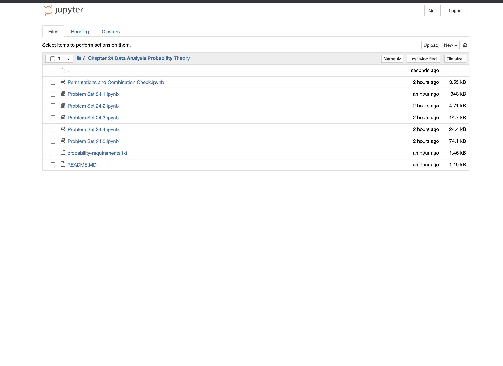

# Chapter 24 Data Analysis. Probability Theory 

## 1. Pre-requisite Softwares 

- We need `python3` to run this python Scripts. [Steps to Download Python3](https://www.python.org/downloads/)
- We intend to follow `pip3` based module installation. 

## 2. Pip3 based Module installation 

- Initiate Python virtual environment for Data Analysis. Probability Theory (In Unix or Mac OS)
```
python3 -m venv probability
source probability/bin/activate
```
(In Windows)
```
python3 -m venv probability
probability\Scripts\activate.bat
```
- You might get a Indication on terminal in which virtual environment you are present like
```
(probability) username@computer-name dir %
```
Further Reference: [python3 Virtual Enviroment Simple Tutorial](https://docs.python.org/3/tutorial/venv.html)

**Important Note:** On System with we both `python2` and `python3`, make sure you have made `python3` as `python` else it would request `python2`(or just use `python3`)
- Install Probality Package requirements 
```
python3 -m pip install -r probability-requirements.txt
```
- (optional) to deactivate from virual environment just do(Do it after running jupyter-notebooks ) 
```
deactivate
```

## 3. Start Jupyter Notebook

- You can start Jupyter notebook just by entering the command 
```
jupyter notebook
```
- This should open a window in default browser 



- Now Double Click any `.ipynb` file this would open the respective chapters